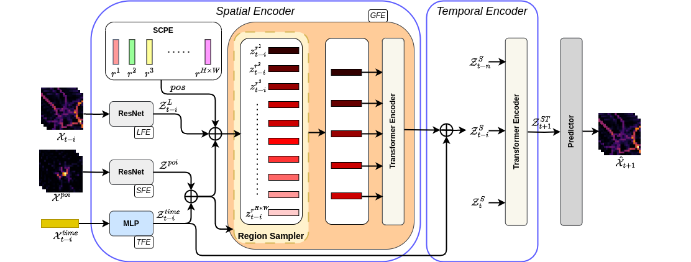

# ST-SampleNet

# Spatially Constrained Transformer with Efficient Global Relation Modelling

## Description
This repository is the implementation of the project "Spatially Constrained Transformer with Efficient Global Relation Modelling" by Ashutosh Sao and Simon Gottschalk. 



## Installation
To install the requirements
```bash
pip install -r requirements.txt
```

# Training & Evaluation
1. To train a model on NYC Dataset, download and save the raw data at a specified location `<location>`. 

2. Set the `dir` under `[data]` in `confing.ini` to the raw data location `<location>`. 

3. Set the `dir` under `[model]` in `confing.ini` to the location where you want to save the trained model.

4. Set the save path to `location` in the jupyter notebook `SCPE.ipynb` and run. 
It ll generate the geohash dictionary used by the model 

5. Finally
Run:
```bash
python main.py
```